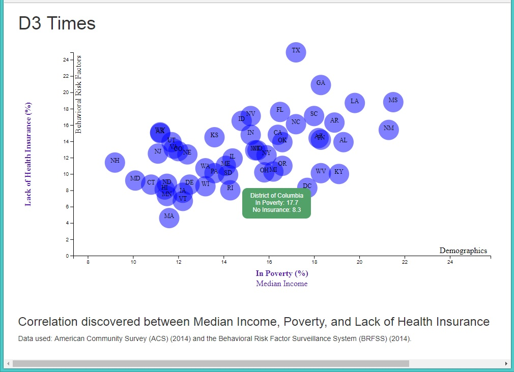
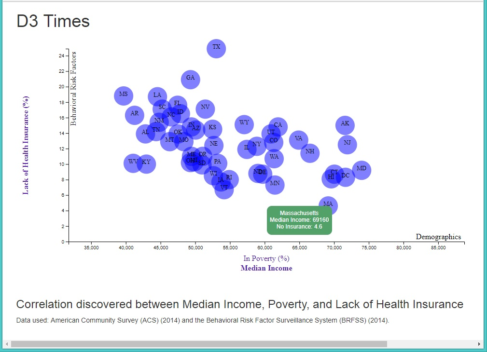

# Data Journalism and D3

### This chart represents a correlation between two data variables, each measured state by state and taken from the following data sources:

* [American FactFinder](http://factfinder.census.gov/faces/nav/jsf/pages/searchresults.xhtml) (2014 ACS 1-year estimates)
	
* [Behavioral Risk Factor Surveillance System](https://chronicdata.cdc.gov/Behavioral-Risk-Factors/BRFSS-2014-Overall/5ra3-ixqq) (2014)

#### Tools used: D3, the JavaScript library for visualizing data with HTML, SVG, and CSS.

